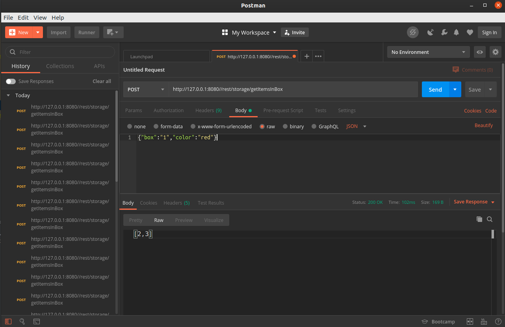

## Решение задачи о ящиках и предметах
Автор решения: Елена Денисова (denisova.dev@gmail.com)

Стек использованных технологий: Java 8 / Spring Boot / Spring Data / Spring Web / Jackson (JSON) / JAXB (XML) / Embedded Tomcat / Embedded-File H2 DB / Slf4j

В качестве БД используется H2 Embedded/File БД, которая сохраняется в файле по пути ./test ( . - текущая папка). Путь можно изменить в application.properties

Программу необходимо собрать через Maven. Также скомпилированный вариант прилагается в этом репозитории: файл storage-1.0.jar

Запускать приложение необходимо следующие образом:
```bash
java -jar storage-1.0.jar test.xml
```
где test.xml - путь к файлу с описанием взаименого положения предметов(Item) и ящиков(Box).

REST-контроллер расположен по адресу: http://127.0.0.1:8080/rest/storage/getItemsInBox

REST-контроллер отвечает на тестовые запросы подобно следующему:
```json
POST /test HTTP/1.1
Host: localhost
Accept: application/json
Content-Type:application/json
Content-Length: 25
{"box":"1","color":"red"}
```

Ответ в Postman на подобный тестовый запрос:



## Текст задания
На вход в виде параметра командной строки java-приложению передаётся
имя XML-файла, в котором задано взаимное положение предметов(Item) и ящиков(Box).
Пример такого файла:
```xml
<?xml version="1.0" encoding="UTF-8"?>
<Storage>
 <Box id="1">
   <Item id="1"/>
   <Item color="red" id="2"/>
   <Box id="3">
       <Item id="3" color="red" />
       <Item id="4" color="black" />    
   </Box>
   <Box id="6"/>
   <Item id="5"/>
 </Box>
 <Item id="6"/>
</Storage>
```
- ящики могут быть пустыми или содержать предметы или другие ящики;
- у каждого ящика и предмета есть id;
- id какого-либо предмета и какого-либо ящика могут совпадать,
 но в совокупности предметов они уникальны (как и в совокупности ящиков);
- вложенность ящиков может быть любой;
- предметы могут не иметь цвета;
- предметы могут быть не в ящике

Требуется написать приложение, которое:

(1) заполняет при старте SQL-БД приведённой ниже структуры в соответствии с переданным XML-файлом

```sql
CREATE TABLE BOX (
    ID INTEGER PRIMARY KEY,
    CONTAINED_IN INTEGER
);

CREATE TABLE ITEM (
    ID INTEGER PRIMARY KEY,
    CONTAINED_IN INTEGER REFERENCES BOX(ID),
    COLOR VARCHAR(100)
);
```

Примечание: выбор СУБД на усмотрение кандидата (как варианты embedded DBMS можно, например, взять: H2, sqlite и т.п.)
В случае использования embedded/in-memory СУБД нужно залогировать в файл содержимое таблиц после загрузки.

(2) После загрузки файла приложение должно работать, как REST-сервис, который возвращает id предметов
заданного цвета(color) содержащиеся в ящике c заданным идентификатором (box) с учётом того, что в ящике может быть ещё ящик с предметами требуемого цвета.

Например, на POST-запрос с телом запроса в JSON вида:
```json
POST /test HTTP/1.1
Host: localhost
Accept: application/json
Content-Type:application/json
Content-Length: 25
{"box":"1","color":"red"}
```
для вышеприведённого XML должен быть ответ вида:
```json
HTTP/1.1 200
Content-Type: application/json;charset=UTF-8
Transfer-Encoding: chunked
Date: Mon, 01 Sep 2019 12:00:26 GMT
[2,3]
```

---------------------------

Проект нужно разместить на GitHub и прислать ссылку.
Время на решение до трех дней.